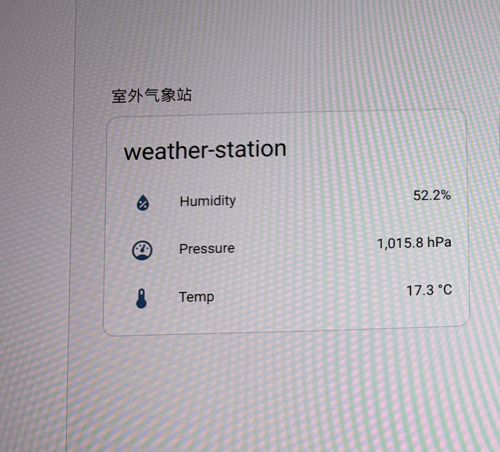
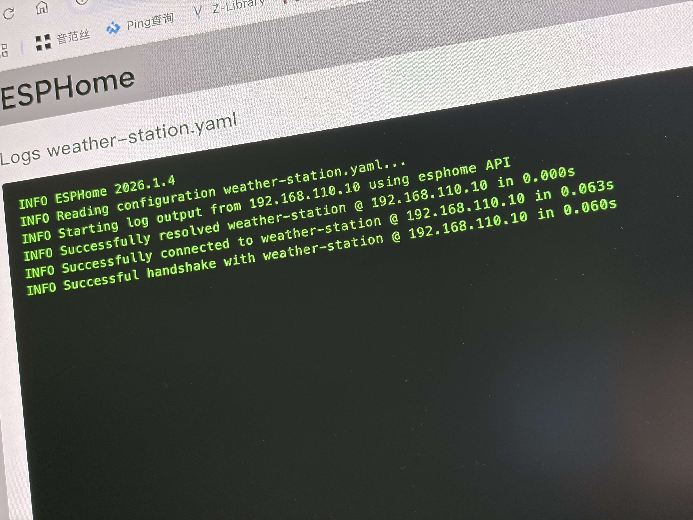

# 🌤️ ESP32-S3 太阳能室外气象站 (Solar-Powered Weather Station)

基于 ESP32-S3 和 ESPHome 构建的纯太阳能供电室外气象站。本项目旨在提供一个无需外部电源、可长期在户外稳定运行的环境数据采集节点，完美无缝接入 Home Assistant。

它可以实时精准检测室外的：
* 🌡️ **温度 (Temperature)**
* 💧 **湿度 (Humidity)**
* 🌪️ **气压 (Barometric Pressure)**

## 📸 项目展示

## 🛠️ 硬件清单 (BOM)

| 组件名称     | 型号/规格                            | 备注/说明                                        |
| :----------- | :----------------------------------- | :----------------------------------------------- |
| **主控板**   | ESP32-S3                             | 性能强劲，支持 Wi-Fi，适合作为 IoT 核心          |
| **传感器**   | 微雪 (Waveshare) BME280              | 高精度温湿度及气压传感器，I2C 通信               |
| **电源管理** | 微雪太阳能电源管理模块               | 负责太阳能充电与电池放电管理，提供稳定的供电输出 |
| **太阳能板** | 6V 太阳能滴胶板/层压板               | 通过 DC 接口直接连接到电源管理模块               |
| **储能电池** | 3.7V 锂电池 (如 14500/18650)         | 搭配微雪电源模块使用，确保持续供电               |
| **其他耗材** | 杜邦线、螺丝、3D打印耗材 (建议 PETG) | 室外使用建议采用抗 UV 和耐高温的耗材打印外壳     |

## 🔌 接线指南 (Wiring Diagram)

整个系统的接线非常简单，主要分为电源部分和传感器通信部分。

### 1. 电源部分
* 将 **6V 太阳能板** 的 DC 插头直接插入 **微雪太阳能电源管理模块** 的 DC 输入口 (Solar In)。
* 将 **锂电池** 接入电源管理模块的电池接口。
* 将电源管理模块的 **5V 输出** 和 **GND** 分别连接至 ESP32-S3 的 **5V (VBUS)** 和 **GND** 引脚。

### 2. 传感器部分 (BME280 -> ESP32-S3)
本项目使用 I2C 协议与 BME280 进行通信：

| 微雪 BME280 模块 | ESP32-S3 引脚 | 描述                                |
| :--------------: | :-----------: | :---------------------------------- |
|       VCC        |     3.3V      | 传感器电源输入 (切勿接5V，以免烧毁) |
|       GND        |      GND      | 共地                                |
|       SDA        |    GPIO 8     | I2C 数据线                          |
|       SCL        |    GPIO 9     | I2C 时钟线                          |

## 📦 3D 打印外壳

本项目包含专门为这些硬件设计的 3D 打印外壳，分为 ESP32 主控舱和电源模块舱，并配有对应的插门设计，方便维护。

所有文件位于 `3d_models` 目录下：
* `/stl`：**可以直接用于切片打印**的文件（已修复法线/流形问题，后缀为 `_fixed.stl`）。建议使用 **PETG** 或 **ASA** 材料打印，以应对室外的高温和日晒。
* `/source`：提供 SketchUp (`.skp`) 源文件。如果你的硬件尺寸（如电池、太阳能板支架）有所不同，可以直接修改源文件进行二次开发。

## 💻 软件部署 (ESPHome)

本项目代码基于 ESPHome 编写，配置文件位于 `esphome/weather-station.yaml`。

1. 在 Home Assistant 或本地安装的 ESPHome Dashboard 中，新建一个设备。
2. 将 `weather-station.yaml` 中的内容复制进去。
3. **注意替换你的 Wi-Fi 信息**（建议使用 `!secret` 管理你的密码）。
4. 编译并刷入 ESP32-S3。

### 🔋 关于功耗优化的建议 (Deep Sleep)
由于是纯太阳能供电，室外阴雨天可能会导致电量入不敷出。为了最大限度延长电池寿命并降低功耗，强烈建议在 `weather-station.yaml` 中启用 ESPHome 的深度睡眠 (Deep Sleep) 功能。
例如，可以配置为每 5 分钟醒来一次，读取 BME280 数据并发送至 Home Assistant，然后立即进入深度睡眠状态。这样可以极大优化功耗表现，让系统在没有阳光的情况下也能运行数周。

## 📄 许可证 (License)
本项目开源，欢迎 Fork 和改进！
